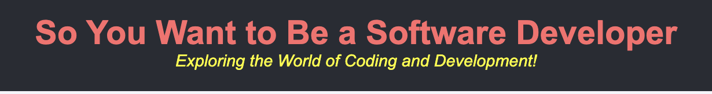
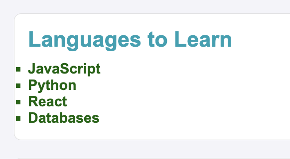
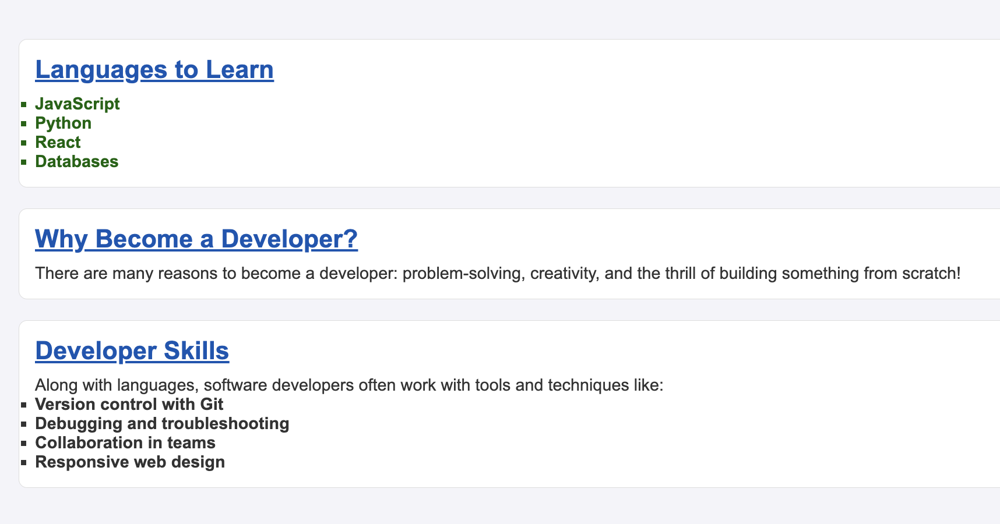
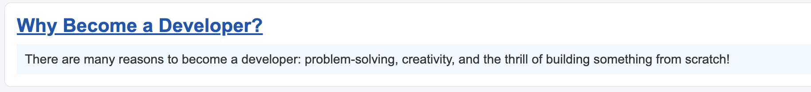
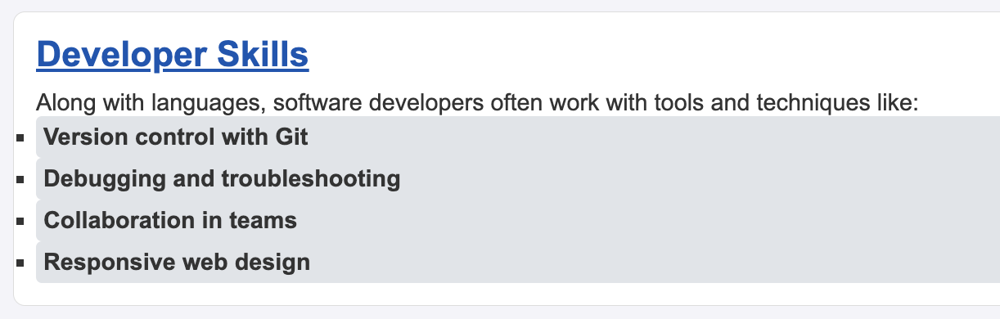
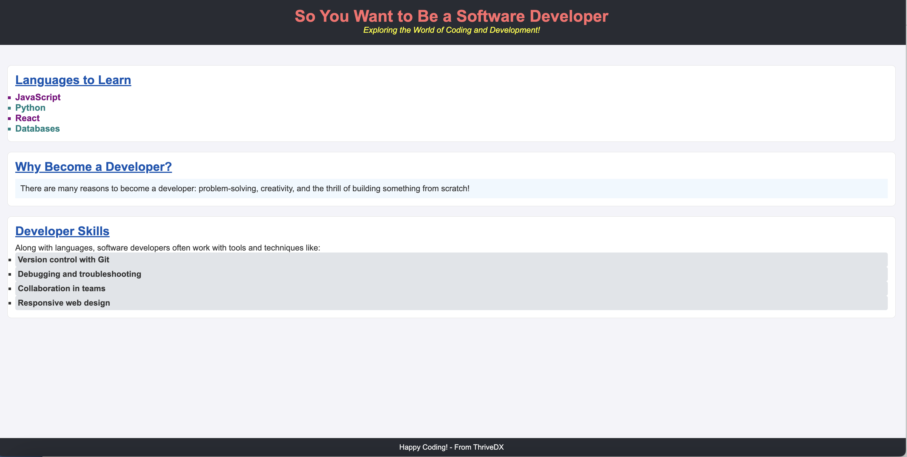

# JavaScript Advanced: Interacting with the DOM

![A simple, informative web page titled 'So You Want to Be a Software Developer.' At the top, a large header reads the main title, followed by a tagline: 'Exploring the World of Coding and Development!' The page is divided into sections. The first section, 'Languages to Learn,' lists JavaScript, Python, React, and Databases. Next is 'Why Become a Developer?' describing reasons like problem-solving and creativity. The third section, 'Developer Skills,' covers tools like Git, debugging, teamwork, and responsive design. At the bottom, the footer encourages 'Happy Coding! - From ThriveDX](./assets/images/example.png)

---

## Description 📄

In this lab, we will focus on **JavaScript DOM manipulation**, allowing students to practice selecting and modifying elements within a web page using JavaScript. You will start with a **base HTML and CSS file** that provides structure and style. Using JavaScript, you will interact with and apply changes to elements within this base HTML, demonstrating how to dynamically manipulate the DOM and create visually engaging web pages.

### Key Concepts Covered:
- **Element Selection Methods**: Use `getElementById`, `getElementsByClassName`, `getElementsByTagName`, `querySelector`, and `querySelectorAll` to target and manipulate HTML elements.
- **Styling with JavaScript**: Apply CSS styles dynamically through JavaScript, enhancing interactivity.
- **Sequential and Timed Changes**: Use timers to stagger changes to elements, creating animated effects.

### By the end of this lab, you will:
- Learn to select and style elements on a web page dynamically.
- Manipulate element properties using various DOM selection methods.
- Apply delays and animations to create engaging, interactive page elements.

---

## Expected Project Structure 🏗️

Your project should be structured as follows:

```plaintext
Interacting-with-the-DOM/
├── index.html
├── styles.css
└── index.js
```

##

## 1. **Fork and Clone the Starter Repository**

- [ ] Begin by **forking** and then **cloning** the starter repository from GitHub to your local development environment. **Do not clone the supplied repository directly**; make sure to fork it first to have your own copy. This repository provides the base HTML and CSS files you’ll use to build out the JavaScript functionality.

[Click here for starter code to fork](https://github.com/HackerUSA-CE/aisd-ajs-05-Interacting-with-the-DOM)

##

## 2. **Create a Blank `index.js` File**

- [ ] Inside your cloned project folder, create a new blank file named `index.js`. This is where you will write all your JavaScript code for interacting with the DOM.

### Note: 
The `index.js` file is already linked in the `HTML` file provided at the bottom of the `<body>` tag, so any JavaScript you write will automatically run when the HTML file is loaded:

```html
<script src="index.js"></script>
```
##

## 3. **Open the index.html file in your browser**

- [ ] Open a terminal in VS Code, navigate to your project directory and use `npx serve` to start a local server and view your `index.html` file in the browser.

- [ ] Run the following command within the projects directory:

```bash
npx serve
```

### Expected Browser Display

![A simple, informative web page titled 'So You Want to Be a Software Developer.' At the top, a large header reads the main title, followed by a tagline: 'Exploring the World of Coding and Development!' The page is divided into sections. The first section, 'Languages to Learn,' lists JavaScript, Python, React, and Databases. Next is 'Why Become a Developer?' describing reasons like problem-solving and creativity. The third section, 'Developer Skills,' covers tools like Git, debugging, teamwork, and responsive design. At the bottom, the footer encourages 'Happy Coding! - From ThriveDX](./assets/images/example3.png)

##

### Step 4: Change the Main Title Color
In this step, we’ll use JavaScript to change the color of the main title by targeting it solely through its unique `id` attribute. The `getElementById` method allows us to select elements by their `id` and directly modify their properties. Here, we’ll use it to access the `<h1>` element with `id="main-title"` and change its `style.color` to a new color.


- [ ] Add the following code to `index.js`:

```javascript
 // Using getElementById to style the main title
const mainTitle = document.getElementById("main-title");
mainTitle.style.color = "#ff6b6b";
```

- [ ] Refresh the browser to apply the changes.

### Expected Browser Display 🌐
![A simple, informative web page titled 'So You Want to Be a Software Developer.' At the top, the main title appears in a new color, followed by a tagline: 'Exploring the World of Coding and Development!' The page is divided into sections. The first section, 'Languages to Learn,' lists JavaScript, Python, React, and Databases. Next is 'Why Become a Developer?' describing reasons like problem-solving and creativity. The third section, 'Developer Skills,' covers tools like Git, debugging, teamwork, and responsive design. At the bottom, the footer encourages 'Happy Coding! - From ThriveDX.'](./assets/images/example4.png)

### Explanation
- **`document.getElementById("main-title")`**: This line selects the element with the `id` of "main-title" from the HTML document. `getElementById` is used specifically for selecting elements by their unique `id`.
- **Storing the Element in `mainTitle`**: The selected element is assigned to a constant variable called `mainTitle`, allowing us to reference this element for styling or other changes.
- **Changing the Color with `style.color`**: The `style.color` property of `mainTitle` is set to `#ff6b6b`, which immediately applies a new color to the title text, making it visually stand out.

##

## 5. **Applying Styles to the Tagline**
In this step, we will select and style the tagline element on the page. The code below changes the color and font style of the tagline using `querySelector`.

- [ ] Add the following JavaScript code to your `index.js` file:

```javascript
  // Using querySelector to style the tagline 
  const tagline = document.querySelector(".tagline");
  tagline.style.color = "yellow";
  tagline.style.fontStyle = "italic";
```

 ### Expected Browser Display 🌐

After applying this JavaScript code, your browser should display the tagline text in yellow and italicized, adding visual emphasis to the tagline. 



### Explanation

- **`const tagline = document.querySelector(".tagline");`**: Here, we're using `querySelector` to select the first element with the class `"tagline"`. 
  - **Why `.tagline`?** Since `querySelector` requires a CSS selector, we need to include the `.` prefix when selecting by class. This is different from methods like `getElementsByClassName`, which only need the class name directly.
  - The `.` in `.tagline` tells `querySelector` that we’re selecting by class rather than an ID (which would use `#`) or another attribute.
  
- **Styling the Element**:
  - `tagline.style.color = "yellow";` changes the text color of the tagline to yellow.
  - `tagline.style.fontStyle = "italic";` applies italic styling to the tagline text.
  
Using `querySelector` this way is efficient when you know there’s only one element with this class, as it selects only the first matching element found in the DOM.

##

## 6. **Applying Styles to Language List Items**

In this step, we will loop through each item with the `language` class and apply a green color with bold styling. We’ll also add a timed delay to each item, creating a gradual highlighting effect.

- [ ] Add the following JavaScript code to your `index.js` file:

```javascript
  // Using getElementsByClassName to style each language item
  const languages = document.getElementsByClassName("language");
  Array.from(languages).forEach((language, index) => {
    setTimeout(() => {
      language.style.color = "darkgreen";
      language.style.fontWeight = "bold";
    }, 500 * index); // Gradually highlights each language
  });
```
### Expected Browser Display 🌐

After applying this JavaScript code, each item in the language list will gradually change to a dark green color and bold font style, creating a sequential highlighting effect, as shown below:



**Explanation:**

- **Selecting Elements by Class**: This code selects all elements with the class `.language` using `getElementsByClassName`, which returns an HTMLCollection of elements.
- **Converting HTMLCollection to Array**: `Array.from` converts the HTMLCollection into an array, allowing us to use an `array loop` with the `forEach` method to iterate through each element.
- **Applying Styles**: Inside the loop, each `language` item’s `color` is set to `darkgreen` and `fontWeight` to `bold`, making each item visually distinct and emphasizing the text.
- **Sequential Styling with `setTimeout`**: The `setTimeout` function applies a delay to each item based on its `index` in the array. The delay is calculated as `500 * index`, where each successive item’s styling is delayed by 500 milliseconds more than the previous one:
  - For the first item (`index = 0`), the delay is `500 * 0 = 0` ms, so it changes immediately.
  - For the second item (`index = 1`), the delay is `500 * 1 = 500` ms.
  - For the third item (`index = 2`), the delay is `500 * 2 = 1000` ms, and so on.
  
This gradually applies the style changes to each item, creating a staggered animation effect where each language item is highlighted in sequence.

##

## 7. **Underlining All Section Titles**

In this step, we’ll select all `<h2>` elements, which serve as section titles, and apply a new color and underline styling. We’ll also add a delay to each title, creating a sequential effect.

- [ ] Add the following JavaScript code to your `index.js` file:

```javascript
  // Using getElementsByTagName to underline all section titles
  const sectionTitles = document.getElementsByTagName("h2");
  Array.from(sectionTitles).forEach((title, index) => {
    setTimeout(() => {
      title.style.color = "#0056b3";
      title.style.textDecoration = "underline";
    }, 700 * index);
  });
```

### Expected Browser Display 🌐

After applying this JavaScript code, each section title will gradually change to a blue color and become underlined in sequence, creating a staggered highlighting effect, as shown below:



**Explanation:**

- This code uses `getElementsByTagName` to select all `<h2>` elements on the page, which are the section titles. The method returns an HTMLCollection containing each `<h2>` element.
- `Array.from` is applied to convert the HTMLCollection into an array, which enables us to use an `array loop` with `forEach` to iterate over each title.
- Inside the loop, each title’s `color` is set to `#0056b3` (a shade of blue), and `textDecoration` is set to `underline`, making the titles visually distinct and easier to read.
- Once again, a  `setTimeout` is used with a delay that increases by 700 milliseconds per `index`, creating a sequential effect where each title is underlined one after the other.

##

## 8. **Styling a Single Element with an ID**

In this step, we’ll use `querySelector` to select a single element by its ID and apply styling changes without any delay.

- [ ] Add the following JavaScript code to your `index.js` file:

```javascript
  // Using querySelector to select and modify a single element with ID
  const reasons = document.querySelector("#reasons");
  reasons.style.backgroundColor = "#f0f8ff";
  reasons.style.padding = "10px";
```

### Expected Browser Display 🌐

After applying this JavaScript code, the `reasons` section should immediately display with a light blue background and additional padding, providing a highlighted look, as shown below:



**Explanation:**

- **`document.querySelector("#reasons")`**: This line selects the first element on the page with the ID `reasons`. In `querySelector`, we use the `#` symbol to specify an ID selector, similar to how it’s used in CSS. The `#` indicates that we’re selecting an element by its unique ID rather than a class or tag.
- **Storing the Element in `reasons`**: The selected element is assigned to the `reasons` constant, allowing us to apply styling directly to this specific section.
- **Changing the Background Color with `style.backgroundColor`**: The `style.backgroundColor` property is set to `#f0f8ff`, which applies a soft, light blue background color to make the section visually distinct.
- **Adding Padding with `style.padding`**: The `style.padding` property adds `10px` of space around the content inside the `reasons` section, providing more breathing room and improving readability.

##

## 9. **Styling Multiple Elements with a Class**

In this step, we’ll use `querySelectorAll` to select all elements with the class `skill` and apply styling changes to each one. A delay is added so that each skill item is styled sequentially.

- [ ] Add the following JavaScript code to your `index.js` file:

```javascript
  // Using querySelectorAll to style each skill element
  const skills = document.querySelectorAll(".skill");
  skills.forEach((skill, index) => {
    setTimeout(() => {
      skill.style.backgroundColor = "#e0e4e8";
      skill.style.padding = "5px";
      skill.style.borderRadius = "4px";
    }, 300);
  });
```

### Expected Browser Display 🌐

After applying this JavaScript code, each skill item should appear with a light gray background, padding, and rounded corners, applied sequentially for a staggered effect, as shown below:



##

**Explanation:**

- **`document.querySelectorAll(".skill")`**: This line selects all elements with the class `skill` using `querySelectorAll`. The `.` prefix specifies that we are targeting a class, similar to CSS selectors.
- **Using `forEach` with `querySelectorAll`**: The `querySelectorAll` method returns a NodeList, which allows us to loop through each element using the `forEach` method.
- **Sequential Styling with `setTimeout`**: The `setTimeout` function is used with a delay that increases based on the `index` of each element. This creates a staggered effect, where each skill item is styled one after the other with a 300-millisecond delay between each.
- **Applying Styles**: The code sets each skill item’s background color to `#e0e4e8` (light gray), adds `5px` of padding for spacing, and rounds the corners with a `borderRadius` of `4px`. This styling gives each item a distinct, styled appearance.

##

## 10. Additional Practice - Selecting Items with Class "language" to Change Text Color and Size

In this example, we’ll select all elements with the class `"language"` and change each item's color and font size. This time, we’ll skip using `setTimeout` for a gradual effect; while not essential, `setTimeout` was previously included as a learning tool to practice timed styling.

Here, we’ll also use the modulo operator `% 2` to alternate colors by identifying even and odd items, assigning different colors accordingly. This approach gives each item its own style without delay, making the code simpler and emphasizing the use of class-based selection and conditional styling.


```javascript
// Applying alternating colors and font size to language items
const items = document.getElementsByClassName("language");
Array.from(items).forEach((item, index) => {
  item.style.color = index % 2 === 0 ? "purple" : "teal";
  item.style.fontSize = "1.1em";
});
```

### Expected Browser Display 🌐

After applying this JavaScript code, each skill item should display sequentially with a light gray background, padding, and rounded corners, providing a visually appealing layout, as shown below:



**Explanation:**

- **`document.getElementsByClassName("language")`**: This line selects all elements with the class `language`, returning an HTMLCollection that includes all matching elements.
- **`Array.from(items)`**: The HTMLCollection is converted to an array using `Array.from`, enabling us to use `forEach` to loop through each item.
- **No `setTimeout` for Immediate Styling**: Unlike previous steps, we’re not using `setTimeout` here, so each item’s style is applied instantly, without any delay or gradual effect.
- **Alternating Colors with `%` (Modulus)**: The `index % 2 === 0` expression checks whether each item’s index is even or odd:
  - If `index % 2 === 0` (even index), the item’s color is set to "purple".
  - If `index % 2 !== 0` (odd index), the item’s color is set to "teal".
- **Changing Font Size**: Each `language` item’s font size is set to `1.1em`, making it slightly larger and enhancing readability.

This approach applies distinct styling to each item in a consistent, immediate way without delays.

##

## 11. **Commit and Push Your Changes to GitHub**

Now that you've completed your code changes, let's commit them and push to your GitHub repository.

- [ ] Open a terminal in VS Code and make sure you’re in your project directory.
- [ ] Run the following commands to add, commit, and push your changes:

```bash
  git add .
  git commit -m "Completed DOM manipulation lab"
  git push origin main
```

##

# Conclusion 📄

In this lab, we explored various DOM manipulation techniques using JavaScript, covering element selection methods like `getElementById`, `getElementsByClassName`, `getElementsByTagName`, `querySelector`, and `querySelectorAll`. Each method allowed us to dynamically modify elements by targeting them through IDs, classes, and tags, creating an interactive and visually engaging web experience.

The use of `setTimeout` was an optional approach in several steps. It allowed us to practice delayed and sequential styling to give the page a gradual, animated effect. However, applying styles immediately without `setTimeout` can simplify the code. Here’s an example of both approaches:

### Example: Styling `.skill` Elements with and without `setTimeout`

- **With `setTimeout` for a gradual effect**:
```javascript
  const skills = document.querySelectorAll(".skill");
  skills.forEach((skill, index) => {
    setTimeout(() => {
      skill.style.backgroundColor = "#e0e4e8";
      skill.style.padding = "5px";
      skill.style.borderRadius = "4px";
    }, 300 * index); // Adds delay for a staggered effect
  });
```

- **Without setTimeout for immediate styling**:
```javascript
const skills = document.querySelectorAll(".skill");
skills.forEach((skill) => {
  skill.style.backgroundColor = "#e0e4e8";
  skill.style.padding = "5px";
  skill.style.borderRadius = "4px";
});
```

### Key Takeaways

- **DOM Selection Mastery**: Knowing how to use `getElementById`, `getElementsByClassName`, `getElementsByTagName`, `querySelector`, and `querySelectorAll` gives you flexibility in selecting and styling elements based on unique IDs, classes, or tags.
- **Immediate vs. Delayed Styling**: `setTimeout` can add a staggered or animated effect, but is optional for most styling changes. Immediate styling is more straightforward and is often the better choice for basic visual adjustments.
- **Dynamic Styling**: By directly manipulating the `style` properties of elements, you can create interactive, visually dynamic pages that respond instantly to user interaction or page load.

This lab provided a hands-on foundation in DOM manipulation that will be essential for building more complex, interactive web applications.

##

### Solution codebase 👀
🛑 **Only use this as a reference** 🛑

💾 **Not something to copy and paste** 💾

**Note:**  This lab references a solution file located [here](https://github.com/HackerUSA-CE/aisd-ajs-05-Interacting-with-the-DOM/tree/solution) (link not shown).

---
© All rights reserved to ThriveDX